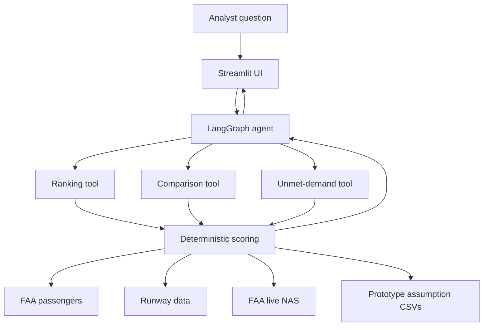

# Airport Investment Intelligence Agent

AI decision-support for identifying US airports with stronger terminal or capacity expansion potential.

The LLM routes the question and explains results. Python calculates rankings, comparisons, and unmet-demand pressure from public data plus labeled prototype assumptions. This is analyst support, not a financial model.

## Assignment coverage

| Assignment example | Implementation |
| --- | --- |
| New England expansion | Deterministic ranking |
| LAX vs SNA congestion | Comparison with live vs structural provenance |
| ANC long-haul | Explicitly labeled share proxy |
| SFO unmet demand | Deterministic pressure index, not unserved flights |

Example prompts:

- Which airports in New England are strong candidates for terminal expansion?
- Compare LAX and SNA congestion levels.
- What is the percentage of long-haul flights out of Anchorage airport?
- What is the unmet flight demand in SFO airport and why?

## Architecture

The LLM decides which calculation to run. Python decides the numerical answer.



## Scoring

```text
Composite =
  Congestion 35% + Growth 30% + Utilization 25% + Secondary 10%

Unmet Demand Pressure =
  Congestion 40% + Utilization 35% + Growth 25%
```

Utilization is passengers per runway on a fixed 1M–8M scale, so an airport keeps the same score in national rankings, regional rankings, and pairwise comparisons. Full rationale is in `design.md`.

## Data

Measured / public:

- `data/airports.csv` and `data/runways.csv`: OurAirports cache
- `data/enplanements.csv`: FAA 2024 commercial-service passenger boardings

Explicit prototype assumptions:

- `data/congestion_baselines.csv`: structural congestion heuristics
- `data/long_haul_proxies.csv`: long-haul share heuristics

Airport and runway caches can refresh if missing. The enplanement cache is checked in for review stability. See `data/README.md`.

## Quick start

Python 3.11+ (3.12 works).

```bash
python -m venv .venv
source .venv/bin/activate   # Windows: .venv\Scripts\activate
pip install -r requirements.txt
cp .env.example .env        # then set GROQ_API_KEY
streamlit run app.py
```

Create a Groq key at https://console.groq.com/keys. Optional OpenRouter fallback and LangSmith fields are in `.env.example`.

Voice input is in the sidebar: Record, then Stop & send. Chat history is stored locally in `data/chat_history.db` and is not part of the submission.

## Tests

Offline tests do not call Groq, LangSmith, FAA, or Streamlit over the network:

```bash
pytest tests/ -v
```

`make check` runs pytest and compile checks. Opt-in live checks:

```bash
python scripts/live_smoke.py
python scripts/e2e_edge_cases.py
```

## Project structure

```text
app.py          Streamlit chat UI
agent.py        LangGraph agent, tool registry, and memory
chat_store.py   SQLite conversation history
tools.py        Ranking, comparison, long-haul, and unmet-demand tools
data_loader.py  Cached public data and candidate assembly
scoring.py      Deterministic scoring
long_haul.py    Long-haul proxy loader
voice_utils.py  Groq Whisper transcription
prompts.py      Modular system-prompt loader
context/        Role, tools, scoring, assumptions, and writing prompts
data/           Public caches and prototype assumption CSVs
tests/          Offline unit and assignment tests
scripts/        Opt-in live smoke and e2e checks
design.md       Architecture, weights, and limitations
```
